---
## Front matter
title: "Создание и процесс обработки программ на языке ассемблера NASM"
subtitle: "Отчёт"
author: "Сидорова Арина Валерьевна"

## Generic otions
lang: ru-RU
toc-title: "Содержание"

## Bibliography
bibliography: bib/cite.bib
csl: pandoc/csl/gost-r-7-0-5-2008-numeric.csl

## Pdf output format
toc: true # Table of contents
toc-depth: 2
lof: true # List of figures
fontsize: 12pt
linestretch: 1.5
papersize: a4
documentclass: scrreprt
## I18n polyglossia
polyglossia-lang:
  name: russian
  options:
	- spelling=modern
	- babelshorthands=true
polyglossia-otherlangs:
  name: english
## I18n babel
babel-lang: russian
babel-otherlangs: english
## Fonts
mainfont: IBM Plex Serif
romanfont: IBM Plex Serif
sansfont: IBM Plex Sans
monofont: IBM Plex Mono
mathfont: STIX Two Math
mainfontoptions: Ligatures=Common,Ligatures=TeX,Scale=0.94
romanfontoptions: Ligatures=Common,Ligatures=TeX,Scale=0.94
sansfontoptions: Ligatures=Common,Ligatures=TeX,Scale=MatchLowercase,Scale=0.94
monofontoptions: Scale=MatchLowercase,Scale=0.94,FakeStretch=0.9
mathfontoptions:
## Biblatex
biblatex: true
biblio-style: "gost-numeric"
biblatexoptions:
  - parentracker=true
  - backend=biber
  - hyperref=auto
  - language=auto
  - autolang=other*
  - citestyle=gost-numeric
## Pandoc-crossref LaTeX customization
figureTitle: "Рис."
tableTitle: "Таблица"
listingTitle: "Листинг"
lofTitle: "Список иллюстраций"
lolTitle: "Листинги"
## Misc options
indent: true
header-includes:
  - \usepackage{indentfirst}
  - \usepackage{float} # keep figures where there are in the text
  - \floatplacement{figure}{H} # keep figures where there are in the text
---

# Цель работы

Освоение процедуры компиляции и сборки программ, написанных на ассемблере NASM.

# Выполнение лабораторной работы 

## Hello, world! 

Создаем каталог для работы с программами на языке ассемблера NASM и создаем текстовый файл, открываем файл с помощью текстового редактора(рис. @fig:001).

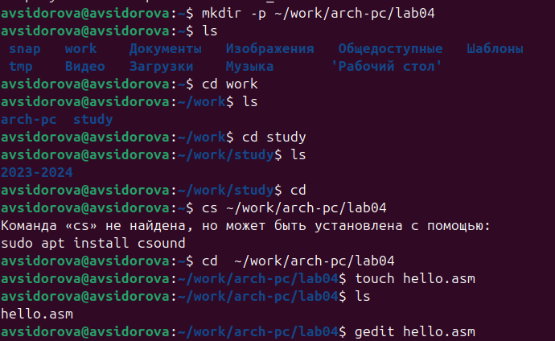{#fig:001 width=70%}

Вписываем команды в файл(рис. @fig:002).

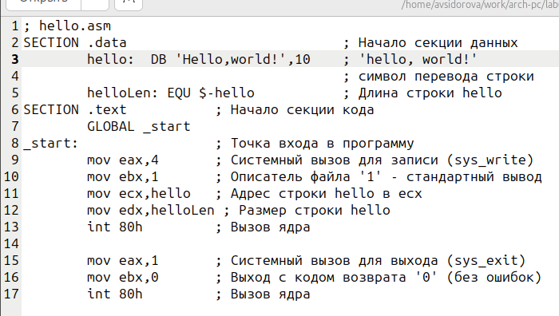{#fig:002 width=70%}

##  Транслятор NASM

Преобразуем текст программы в объектный код (рис. @fig:003)

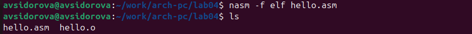{#fig:003 width=70%}

## Расширенный синтаксис командной строки NASM

Выполняем команды, скомпилируем исходный файл, проверим создался ли он (рис. @fig:004)

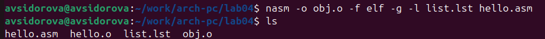{#fig:004 width=70%}

## Компоновщик LD

Объектный файл передаем на обработку компоновщику:(рис. @fig:005)

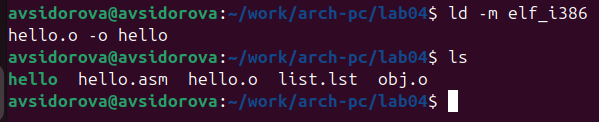{#fig:005 width=70%}

Выполняем следующую команду:(рис. @fig:006)

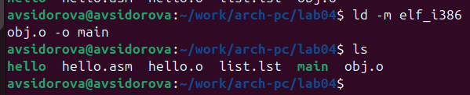{#fig:006 width=70%}

## Запуск исполняемого файла

Запустим на выполнение созданный исполняемый файл, находящийся в текущем каталоге(рис. @fig:007)

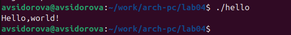{#fig:007 width=70%}

## Задание для самостоятельной работы

В каталоге ~/work/arch-pc/lab04 с помощью команды cp создаем копию файла hello.asm с именем lab4.asm 

С помощью текстового редактора вносим изменения в текст программы в файле lab4.asm так, чтобы вместо Hello world! на экран выводилась строка с моим ФИО (рис. @fig:008) (рис. @fig:009).

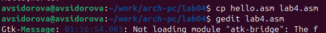{#fig:008 width=70%}

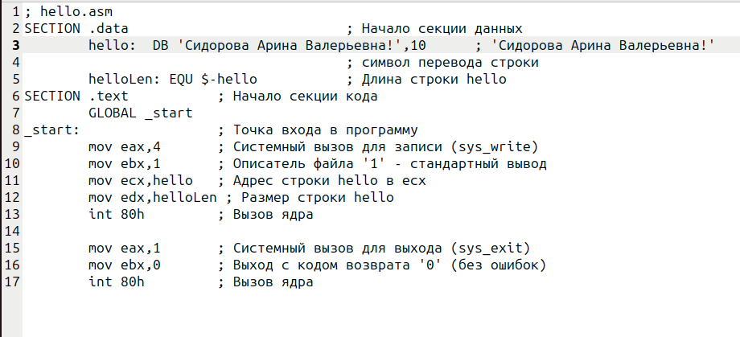{#fig:009 width=70%}

Оттранслируем полученный текст программы lab4.asm в объектный файл. Выполним компоновку объектного файла и запустим получившийся исполняемый файл.(рис. @fig:010).

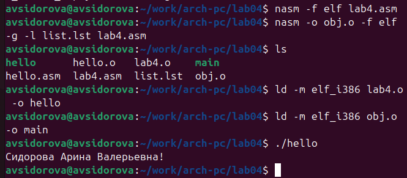{#fig:010 width=70%}

Скопируем файлы hello.asm и lab4.asm в локальный репозиторий в каталог ~/work/study/2023-2024/"Архитектура компьютера"/arch-pc/labs/lab04/. Загрузим файлы на Github.(рис. @fig:011)(рис. @fig:012)

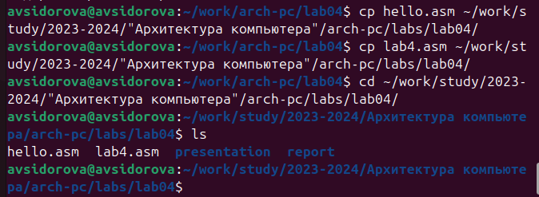{#fig:011 width=70%}

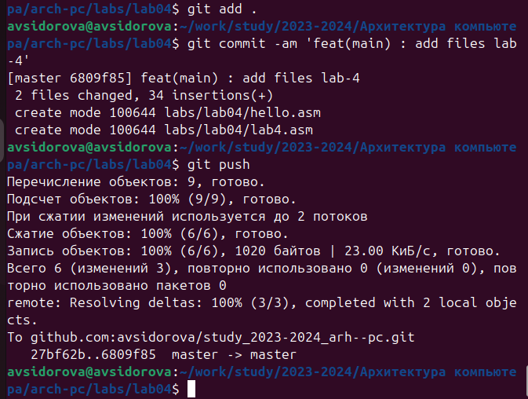{#fig:012 width=70%}

# Выводы

Мы познакомились с языком ассемблера NASM и создали две работающих программы.

