---
## Front matter
title: "Лабораторная работа №5"
subtitle: "Основы работы с Midnight Commander (mc).Cтруктура программы на языке ассемблера NASM. Системные вызовы в ОС GNU Linux"
author: "Сидорова Арина Валерьевна"

## Generic otions
lang: ru-RU
toc-title: "Содержание"

## Bibliography
bibliography: bib/cite.bib
csl: pandoc/csl/gost-r-7-0-5-2008-numeric.csl

## Pdf output format
toc: true # Table of contents
toc-depth: 2
lof: true # List of figures
lot: true # List of tables
fontsize: 12pt
linestretch: 1.5
papersize: a4
documentclass: scrreprt
## I18n polyglossia
polyglossia-lang:
  name: russian
  options:
	- spelling=modern
	- babelshorthands=true
polyglossia-otherlangs:
  name: english
## I18n babel
babel-lang: russian
babel-otherlangs: english
## Fonts
mainfont: IBM Plex Serif
romanfont: IBM Plex Serif
sansfont: IBM Plex Sans
monofont: IBM Plex Mono
mathfont: STIX Two Math
mainfontoptions: Ligatures=Common,Ligatures=TeX,Scale=0.94
romanfontoptions: Ligatures=Common,Ligatures=TeX,Scale=0.94
sansfontoptions: Ligatures=Common,Ligatures=TeX,Scale=MatchLowercase,Scale=0.94
monofontoptions: Scale=MatchLowercase,Scale=0.94,FakeStretch=0.9
mathfontoptions:
## Biblatex
biblatex: true
biblio-style: "gost-numeric"
biblatexoptions:
  - parentracker=true
  - backend=biber
  - hyperref=auto
  - language=auto
  - autolang=other*
  - citestyle=gost-numeric
## Pandoc-crossref LaTeX customization
figureTitle: "Рис."
tableTitle: "Таблица"
listingTitle: "Листинг"
lofTitle: "Список иллюстраций"
lotTitle: "Список таблиц"
lolTitle: "Листинги"
## Misc options
indent: true
header-includes:
  - \usepackage{indentfirst}
  - \usepackage{float} # keep figures where there are in the text
  - \floatplacement{figure}{H} # keep figures where there are in the text
---

# Цель работы

Приобретение практических навыков работы в Midnight Commander. Освоение инструкций
языка ассемблера mov и int.

# Задание

Написать 2 программы по примеру и изменить их по условию.

# Выполнение лабораторной работы

Открываем Midnight Commander. С помощью функциональной клавиши F7 создаем папку lab05 и переходим в созданный каталог.Пользуясь строкой ввода и командой touch создаем файл lab5-1.asm (рис. @fig:001)(рис. @fig:002)

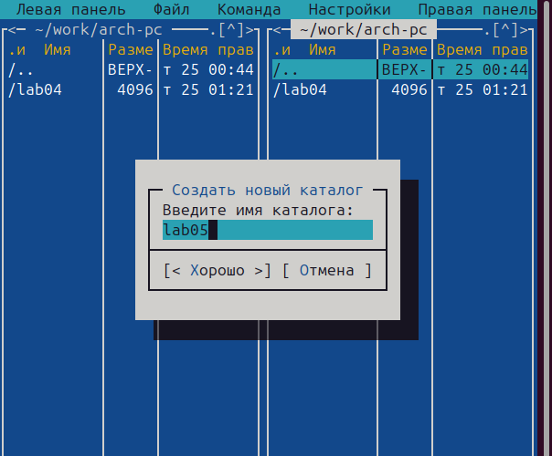{#fig:001 width=70%}

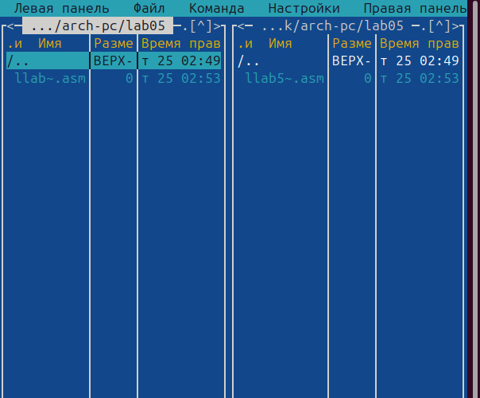{#fig:002 width=70%}

С помощью функциональной клавиши F4 откроем файл lab5-1.asm для редактирования во встроенном редакторе.Введем текст программы из листинга, сохраним изменения и закроемфайл. Оттранслируем текст программы lab5-1.asm в объектный файл. Выполним компоновку объектного файла и запустим получившийся исполняемый файл(рис. @fig:003)(рис. @fig:004)(рис. @fig:005)(рис. @fig:007)(рис. @fig:006).

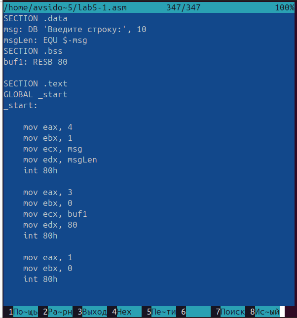{#fig:003 width=70%}

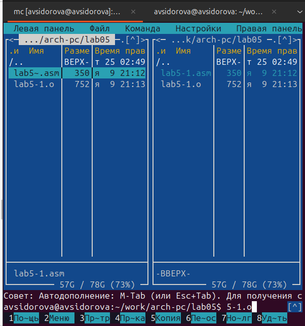{#fig:004 width=70%}

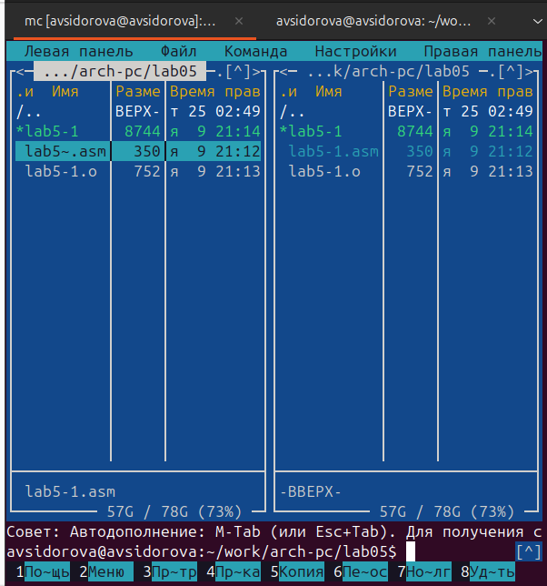{#fig:005 width=70%}

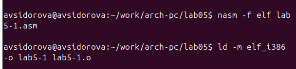{#fig:007 width=70%}

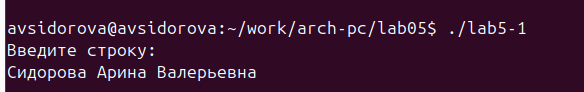{#fig:006 width=70%}

Скачаем файл in_out.asm. В одной из панелей mc откроем каталог с файлом lab5-1.asm. В другой панели каталог со скаченным файлом in_out.asm.Скопируем файл in_out.asm в каталог с файлом lab5-1.asm с помощью функциональной клавиши F5.

С помощью функциональной клавиши F6 создаем копию файла lab5-1.asm с именем lab5-2.asm.Исправим текст программы в файле lab5-2.asm с использование подпрограмм из внешнего файла in_out.asm ( sprintLF, sread и quit) в соответствии с листингом. Создаем исполняемый файл и проверяем его работу.В файле lab5-2.asm заменим подпрограмму sprintLF на sprint. Создадим исполняемый файл и проверим его работу. Видим, что использование sprintLF переносит строку, а sprint - нет(рис. @fig:008)(рис. @fig:009)(рис. @fig:010)(рис. @fig:011)(рис. @fig:012).

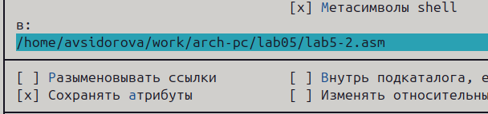{#fig:008 width=70%}

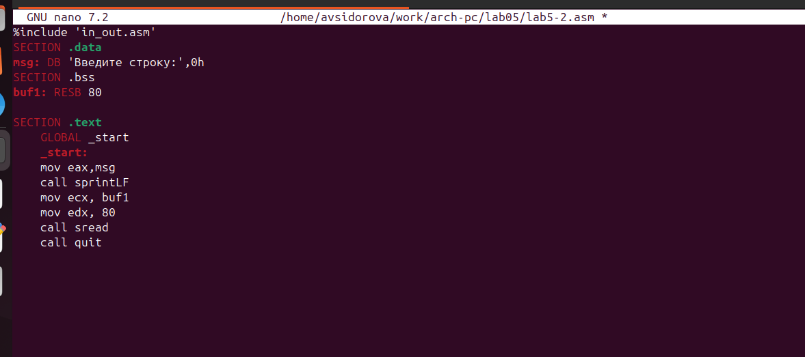{#fig:009 width=70%}

{#fig:010 width=70%}

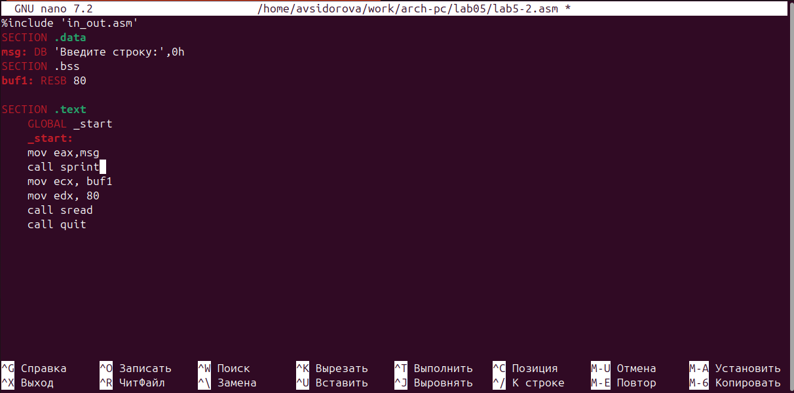{#fig:011 width=70%}

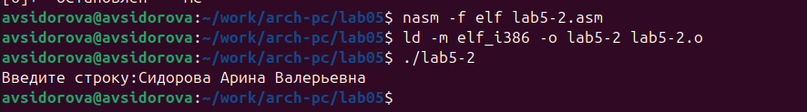{#fig:012 width=70%}

# Самостоятельная работа

Создаем копию файла lab5-1.asm. Вносим изменения в программу (без использования внешнего файла in_out.asm), так чтобы она выводила строку которую мы ввели(рис. @fig:013)(рис. @fig:014)(рис. @fig:015).

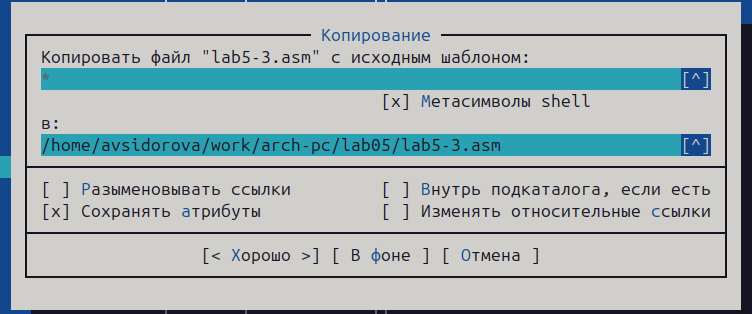{#fig:013 width=70%}

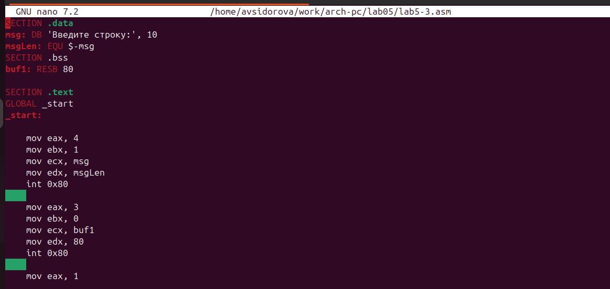{#fig:014 width=70%}

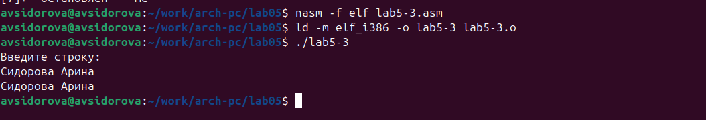{#fig:015 width=70%}

Создаем копию файла lab5-2.asm. Исправляем текст программы с использование подпрограмм из внешнего файла in_out.asm  (рис. @fig:016)(рис. @fig:017)(рис. @fig:018).

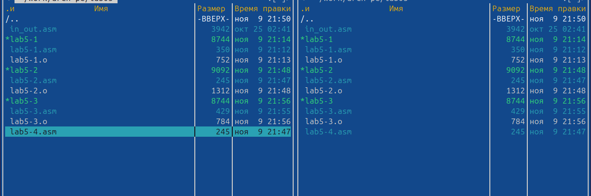{#fig:016 width=70%}

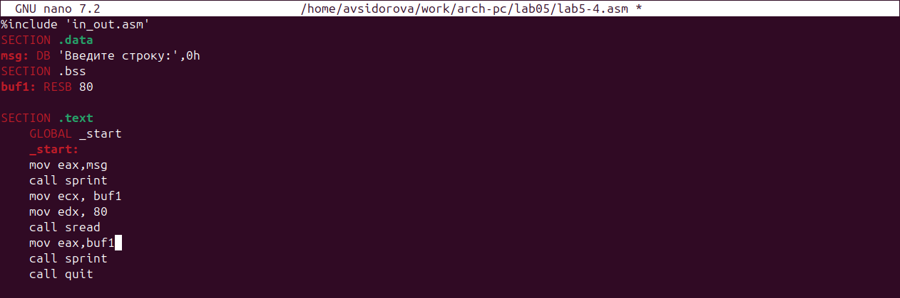{#fig:017 width=70%}

{#fig:018 width=70%}

# Выводы

Мы приобрели навыки работы с Midnight Commander и освоили инструкции языка ассемблера mov и int.

