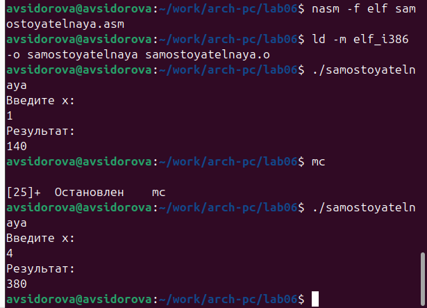

---
## Front matter
title: "Отчёта по лабораторной работе №6"
subtitle: "Арифметические операции в NASM."
author: "Сидорова Арина Валерьевна"

## Generic otions
lang: ru-RU
toc-title: "Содержание"

## Bibliography
bibliography: bib/cite.bib
csl: pandoc/csl/gost-r-7-0-5-2008-numeric.csl

## Pdf output format
toc: true # Table of contents
toc-depth: 2
lof: true # List of figures
fontsize: 12pt
linestretch: 1.5
papersize: a4
documentclass: scrreprt
## I18n polyglossia
polyglossia-lang:
  name: russian
  options:
	- spelling=modern
	- babelshorthands=true
polyglossia-otherlangs:
  name: english
## I18n babel
babel-lang: russian
babel-otherlangs: english
## Fonts
mainfont: PT Serif
romanfont: PT Serif
sansfont: PT Sans
monofont: PT Mono
mainfontoptions: Ligatures=TeX
romanfontoptions: Ligatures=TeX
sansfontoptions: Ligatures=TeX,Scale=MatchLowercase
monofontoptions: Scale=MatchLowercase,Scale=0.9
## Biblatex
biblatex: true
biblio-style: "gost-numeric"
biblatexoptions:
  - parentracker=true
  - backend=biber
  - hyperref=auto
  - language=auto
  - autolang=other*
  - citestyle=gost-numeric
## Pandoc-crossref LaTeX customization
figureTitle: "Рис."
tableTitle: "Таблица"
listingTitle: "Листинг"
lofTitle: "Список иллюстраций"
lolTitle: "Листинги"
## Misc options
indent: true
header-includes:
  - \usepackage{indentfirst}
  - \usepackage{float} # keep figures where there are in the text
  - \floatplacement{figure}{H} # keep figures where there are in the text
---

# Цель работы

Освоение арифметических инструкций языка ассемблера NASM.

# Выполнение лабораторной работы

## 1.Cимвольные и численные данные в NASM

Создаем каталог для программ лабораторной работы № 6, переходим в него и создаем файл lab6-1.asm: (рис. @fig:001).

{#fig:001 width=70%}

Введем в файл lab6-1.asm текст программы из листинга 6.1.(рис. @fig:002).

{#fig:002 width=70%}

Создаем исполняемый файл и запускаем его (рис. @fig:003).

{#fig:003 width=70%}

Далее изменим текст программы и вместо символов, запишем в регистры числа. Исправим текст программы ((рис. @fig:004).

{#fig:004 width=70%}

Создаем исполняемый файл и запускаем его (рис. @fig:005).

{#fig:005 width=70%}

Создаем файл lab6-2.asm в каталоге ~/work/arch-pc/lab06(рис. @fig:006).

{#fig:006 width=70%}

Введим в него текст программы из листинга 6.2. (рис. @fig:007).

{#fig:007 width=70%}

Создаем исполняемый файл и запускаем его (рис. @fig:008).

{#fig:008 width=70%}

Аналогично предыдущему примеру изменим символы на числа. (рис. @fig:009).

{#fig:009 width=70%}

Создаем исполняемый файл и запускаем его (рис. @fig:010).

{#fig:010 width=70%}

В результате программы получаем число 10

Заменим функцию iprintLF на iprint.(рис. @fig:011).

{#fig:011 width=70%}

Создаем исполняемый файл и запускаем его (рис. @fig:012).

{#fig:012 width=70%}

Вывод функций iprintLF и iprint отличаются тем, что iprintLF делает перенос на новую строку.

## 2.Выполнение арифметических операций в NASM

Создайте файл lab6-3.asm в каталоге ~/work/arch-pc/lab06 (рис. @fig:013).

{#fig:013 width=70%}

Внимательно изучим текст программы из листинга 6.3 и введем в lab6-3.asm.(рис. @fig:014).

{#fig:014 width=70%}

Создаем исполняемый файл и запускаем его (рис. @fig:015).

{#fig:015 width=70%}

Изменим текст программы для вычисления выражения f(x) = (4*6+2)/5 (рис. @fig:016).

{#fig:016 width=70%}

Создадим исполняемый файл и проверим его работу. (рис. @fig:017).

{#fig:017 width=70%}

Создадим файл variant.asm в каталоге ~/work/arch-pc/lab06 (рис. @fig:018).

{#fig:018 width=70%}

Внимательно изучим текст программы из листинга 6.4 и введем в файл variant.asm.(рис. @fig:019).

{#fig:019 width=70%}

Создадим исполняемый файл и запустим его. (рис. @fig:020).

{#fig:020 width=70%}

1. Какие строки листинга 6.4 отвечают за вывод на экран сообщения ‘Ваш вариант:’?
Строки "mov eax,rem", "call sprint" 

2. Для чего используется следующие инструкции?
mov ecx, x
mov edx, 80
call sread

Эти инструкции вместе подготавливают необходимые параметры для вызова функции sread, которая затем считывает строку, введенную пользователем, и сохраняет ее в переменной x.

3. Для чего используется инструкция “call atoi”?
call atoi используется для преобразования строки, введенной пользователем, в целое число

4. Какие строки листинга 6.4 отвечают за вычисления варианта?
Строка "xor edx,edx" обнуляет регистр edx перед выполнением деления. 
Строка "mov ebx,20" загружает значение 20 в регистр ebx. Строка "div ebx" выполняет деление регистра eax на значение регистра ebx с сохранением частного в регистре eax и остатка в регистре edx.

5. В какой регистр записывается остаток от деления при выполнении инструкции “div ebx”?
В регистр edx.

6. Для чего используется инструкция “inc edx”?
Для увеличения значения в регистре edx на 1. В нашем коде она увеличивает остаток от деления на 1

7. Какие строки листинга 6.4 отвечают за вывод на экран результата вычислений?
Строка "mov eax,edx" передает значение остатка от деления в регистр eax. Строка "call iprintLF" вызывает процедуру iprintLF для вывода значения на экран вместе с переводом строки.

## Задание для самостоятельной работы

Создаем файл samostoyatelnaya.asm Открываем его и пишем программу для решения выражения f(x) = (8x+6)*10 (рис. @fig:021 @fig:022)

{#fig:021 width=70%}

{#fig:022 width=70%}

Компилируем программу и проверяем работу(рис. @fig:023).

{#fig:023 width=70%}

# Выводы

Освоили арифметические инструкции языка ассемблера NASM.
